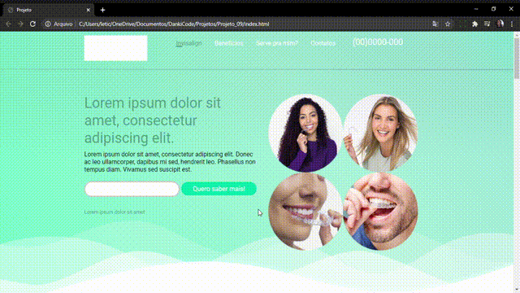

### Projeto_08

O Projeto_08 foi desenvolvido para treinar minhas habilidades em HTML, CSS e JavaScript.

### Características
Esta Landing Page exibe uma maneira de mostrar seu trabalho, também pode ser adaptada a páginas de vendas. 
- Funciona em todos os tipos de telas.
- HTML
- CSS
- JavaScript

### Instalação 

Clone este repositório usando git clone https://github.com/Leticiafrnc/Projeto_08.git ou clique em Code/Download ZIP.
Clique no arquivo "index.HTML" e veja a aplicação.

### Observação: Se abrir a aplicação no celular, tablet ou qualquer tipo de tela a aplicação se adapta.
